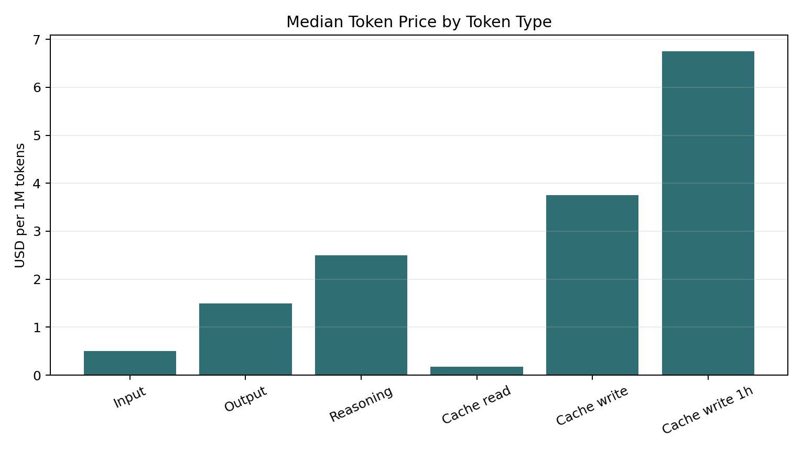
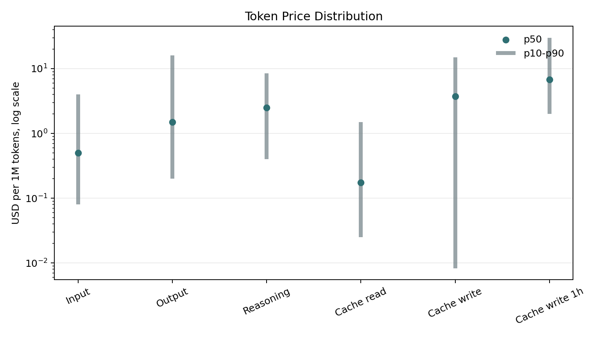
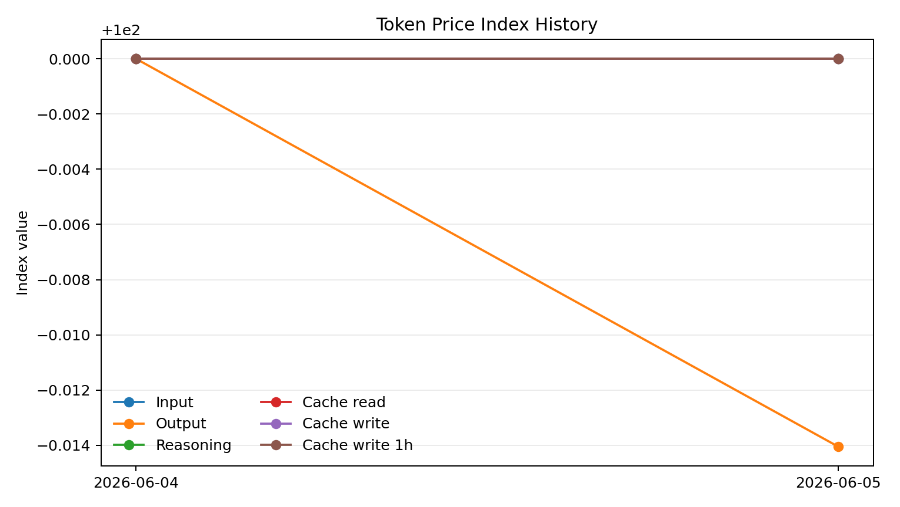
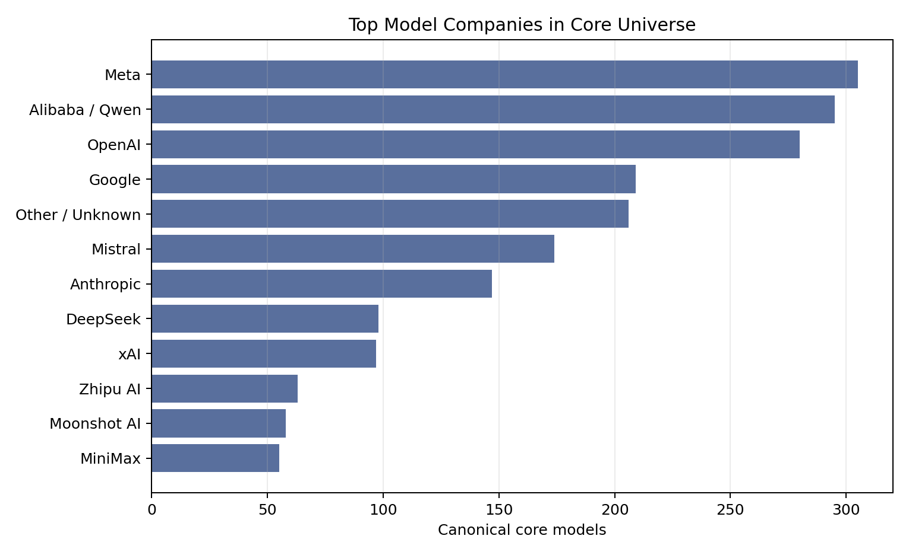

# LLM Token Price Index: Method and Results

Snapshot date: `2026-06-05`

This index tracks the public list prices that model providers and routing catalogs publish for LLM API tokens. It is a price index, not a usage index. It tells us how posted token prices move over time, not how much customers actually spend.

## Plain English Summary

The LLM Token Price Index measures prices for six kinds of token usage:

| Token type | What it means |
|---|---|
| `input` | Tokens sent into a model as the prompt or context |
| `output` | Tokens generated by the model |
| `reasoning` | Internal thinking/reasoning tokens when priced separately |
| `cache_read` | Discounted tokens read from prompt cache |
| `cache_write` | Tokens written into prompt cache |
| `cache_write_1h` | One-hour cache-write prices where providers expose them |

Every price is converted into:

```text
USD per 1 million tokens
```

The current headline medians are:

```text
input:          $0.50 / 1M tokens
output:         $1.50 / 1M tokens
reasoning:      $2.50 / 1M tokens
cache_read:     $0.175 / 1M tokens
cache_write:    $3.75 / 1M tokens
cache_write_1h: $6.75 / 1M tokens
```

The main conclusion is directionally sensible: output tokens cost more than input tokens, cache reads are cheaper than normal input, cache writes are more expensive, and reasoning-token coverage exists but is still limited.

## Data Sources

The index uses public price data from:

| Source | What it contributes |
|---|---|
| OpenRouter | Live model catalog with prompt, completion, reasoning, and cache prices |
| Portkey | Broad provider pricing catalogs |
| LiteLLM | Broad open-source pricing JSON used by many AI infrastructure projects |
| Simon Willison llm-prices | Clean current and limited historical input/output/cached-input prices |

Source links:

- OpenRouter live models API: https://openrouter.ai/api/v1/models
- Portkey pricing catalogs: https://github.com/Portkey-AI/models
- LiteLLM pricing JSON: https://github.com/BerriAI/litellm/blob/main/model_prices_and_context_window.json
- Simon current prices: https://www.llm-prices.com/current-v1.json
- Simon historical prices: https://www.llm-prices.com/historical-v1.json

## What Is a Raw Observation?

A raw observation is one price record from one source for one model and one token type.

For example, if LiteLLM reports a cache-read price for `gpt-4o`, that is one raw observation. If Portkey also reports an output-token price for the same model, that is another raw observation.

Raw observations are useful because they preserve what each source said before we clean or combine anything.

Example raw observations:

| Source | Provider | Model | Company | Family | Token type | Price per 1M tokens | In headline universe? |
|---|---|---|---|---|---|---:|---|
| LiteLLM | Azure | `azure/eu/gpt-4o-2024-08-06` | OpenAI | GPT-4o | cache read | $1.375 | yes |
| LiteLLM | Bedrock | `anthropic.claude-3-5-haiku-20241022-v1:0` | Anthropic | Claude 3.5 | cache read | $0.08 | yes |
| LiteLLM | DeepInfra | `deepinfra/google/gemini-2.5-flash` | Google | Gemini 2.5 | input | $0.30 | yes |
| LiteLLM | DeepSeek | `deepseek-chat` | DeepSeek | DeepSeek Chat | cache read | $0.028 | yes |
| LiteLLM | Azure AI | `azure_ai/grok-4` | xAI | Grok 4 | input | $3.00 | yes |

Raw file: [normalized_prices_latest.csv](../csv/normalized_prices_latest.csv)

## How the Headline Index Is Built

The raw data is intentionally broad. It includes not just chat models, but also embeddings, image models, audio models, video models, moderation models, rerankers, search APIs, and provider-specific endpoint names.

For the headline index, we keep only token-priced text-generation models.

Excluded from the headline index:

- embedding models
- image-generation-only models
- audio/speech/transcription models
- video-generation models
- rerankers
- moderation models
- OCR models
- search-only APIs
- computer-use-only SKUs
- models that output image, audio, or video

Included:

- text-only LLMs
- multimodal-input models if their output is text

The current headline universe includes `331` multimodal-input/text-output rows.

## Combining Multiple Source Listings

The same model can appear multiple times because different sources may report it under slightly different names.

Example:

```text
gpt-4o
azure/eu/gpt-4o-2024-08-06
openai/gpt-4o
```

These are treated as the same cleaned model family when possible.

For each model and token type, we create one cleaned headline row using:

```text
cleaned provider + cleaned model id + token type
```

When multiple sources report the same cleaned model/token price, we use the median reported price. The row still keeps the source count and min/max source prices, so the data team can audit disagreements.

Example cleaned headline rows:

| Cleaned provider | Cleaned model | Company | Family | Token type | Headline price per 1M | Source count | Sources |
|---|---|---|---|---|---:|---:|---|
| Anthropic | `claude-3-5-haiku-20241022` | Anthropic | Claude 3.5 | input | $0.80 | 1 | Portkey |
| Anthropic | `claude-3-5-haiku-20241022` | Anthropic | Claude 3.5 | output | $4.00 | 1 | Portkey |
| Anthropic | `claude-3-5-haiku-20241022` | Anthropic | Claude 3.5 | cache read | $0.08 | 1 | Portkey |
| Anthropic | `claude-3-5-haiku-20241022` | Anthropic | Claude 3.5 | cache write | $1.00 | 1 | Portkey |

Cleaned headline file: [core_prices_latest.csv](../csv/core_prices_latest.csv)

## Index Formula

Each token type gets its own index.

The baseline date is `2026-06-04`. On the baseline date, each token-type index starts at `100`.

For later dates:

```text
index value = average proportional price change vs the baseline * 100
```

The implementation uses a geometric average. In plain terms, this avoids a few extremely expensive or unusual model prices dominating the whole index.

Headline index file: [price_index_latest.csv](../csv/price_index_latest.csv)

## Current Coverage

Current snapshot:

```text
raw observations:              12,838
positive raw observations:     11,687
cleaned headline observations:  8,780
```

Headline observations by token type:

```text
input:          3,671
output:         3,636
cache_read:     1,018
cache_write:      297
cache_write_1h:   109
reasoning:         49
```

Rows excluded from the headline universe are mostly non-text-generation SKUs:

```text
audio:          187
embed:          169
video:           78
tts:             60
rerank:          38
search-api:      30
image/flux:      30
moderation:      28
ocr:             28
```

## Current Results

Median public list prices:

```text
input:          $0.50 / 1M tokens
output:         $1.50 / 1M tokens
reasoning:      $2.50 / 1M tokens
cache_read:     $0.175 / 1M tokens
cache_write:    $3.75 / 1M tokens
cache_write_1h: $6.75 / 1M tokens
```

Percentiles:

| Token type | p10 | p25 | p50 / median | p75 | p90 |
|---|---:|---:|---:|---:|---:|
| cache read | 0.025 | 0.06 | 0.175 | 0.50 | 1.50 |
| cache write | 0.0083 | 0.30 | 3.75 | 6.25 | 15.00 |
| cache write 1h | 2.00 | 6.00 | 6.75 | 10.00 | 30.00 |
| input | 0.08 | 0.20 | 0.50 | 1.75 | 4.00 |
| output | 0.20 | 0.40 | 1.50 | 6.00 | 16.00 |
| reasoning | 0.40 | 1.50 | 2.50 | 4.20 | 8.52 |





## Current Index Values

There are currently two live snapshots: `2026-06-04` and `2026-06-05`.

| Token type | 2026-06-04 | 2026-06-05 |
|---|---:|---:|
| cache read | 100.000 | 100.000 |
| cache write | 100.000 | 100.000 |
| cache write 1h | 100.000 | 100.000 |
| input | 100.000 | 100.000 |
| output | 100.000 | 99.986 |
| reasoning | 100.000 | 100.000 |

There is no meaningful trend yet. The only movement is a tiny output-token change caused by a catalog/source change, not a broad market price move.



## Company and Model Taxonomy

Each cleaned headline row is labeled by model company and model family.

Top companies by cleaned model count:

| Company | Cleaned model count |
|---|---:|
| Meta | 305 |
| Alibaba / Qwen | 295 |
| OpenAI | 280 |
| Google | 209 |
| Mistral | 174 |
| Anthropic | 147 |
| DeepSeek | 98 |
| xAI | 97 |
| Zhipu AI | 63 |
| Moonshot AI | 58 |
| MiniMax | 55 |
| ByteDance | 52 |
| Amazon | 34 |
| AI21 | 32 |
| Microsoft | 29 |
| Cohere | 28 |



Representative taxonomy:

| Company | Main model families in the headline universe |
|---|---|
| OpenAI | GPT-5, GPT-4o, GPT-4.1, GPT-4, GPT OSS, OpenAI o-series |
| Anthropic | Claude 4, Claude 3.7, Claude 3.5, Claude 3 |
| Google | Gemini 3, Gemini 2.5, Gemini 2, Gemini 1, Gemma |
| Meta | Llama 4, Llama 3.3, Llama 3.2, Llama 3.1, Llama 3, Llama 2 |
| Alibaba / Qwen | Qwen3, Qwen2.5, Qwen2, QwQ / QVQ |
| Mistral | Mistral Large, Mistral Medium, Mistral Small, Ministral, Mixtral, Codestral, Magistral, Devstral, Pixtral |
| DeepSeek | DeepSeek R1, DeepSeek V3, DeepSeek Chat, DeepSeek Coder |
| xAI | Grok 4, Grok 3, Grok 2, Grok |
| Amazon | Nova, Titan |
| Moonshot AI | Kimi |
| Zhipu AI | GLM |
| MiniMax | MiniMax |
| ByteDance | Seed, UI-TARS |
| Microsoft | Phi |
| Cohere | Command |
| AI21 | Jamba |
| Perplexity | Sonar |
| NVIDIA | Nemotron |

Full taxonomy files:

- [model_taxonomy_latest.csv](../csv/model_taxonomy_latest.csv)
- [model_taxonomy_latest.md](../csv/model_taxonomy_latest.md)

## CSV Guide

### `normalized_prices_latest.csv`

This is the raw audit table after unit conversion. It contains every observed source price, including rows that are not used in the headline index.

Main column groups:

| Columns | Meaning |
|---|---|
| `snapshot_date`, `source`, `source_url`, `source_updated_at` | When and where the price came from |
| `provider`, `model_id`, `model_name` | The provider/model label as reported by the source |
| `token_type`, `price_usd_per_1m` | The normalized token type and price |
| `raw_price`, `raw_unit`, `pricing_plan`, `price_dimension` | The original source price details |
| `mode`, `context_length`, `tokenizer` | Model metadata when available |
| `canonical_provider`, `canonical_model_id` | Cleaned provider/model names used for grouping |
| `model_company`, `model_family`, `official_pricing_url` | Taxonomy labels |
| `is_core_model`, `core_exclusion_reason` | Whether the row is included in the headline universe |

### `core_prices_latest.csv`

This is the cleaned headline table. It combines multiple source listings for the same canonical model/token type into one row.

Main column groups:

| Columns | Meaning |
|---|---|
| `canonical_provider`, `canonical_model_id`, `token_type` | The cleaned model/token series. These are the actual CSV field names. |
| `price_usd_per_1m` | The headline price, using the median when multiple sources report the same series |
| `min_source_price_usd_per_1m`, `max_source_price_usd_per_1m`, `source_price_spread_usd_per_1m` | How much the sources agree or disagree |
| `source_count`, `sources`, `source_model_ids` | Which sources contributed to the row |
| `model_company`, `model_family`, `official_pricing_url` | Taxonomy and validation metadata |

### `price_index_latest.csv`

This is the headline index table.

| Column | Meaning |
|---|---|
| `snapshot_date` | Date of the index snapshot |
| `token_type` | Input, output, reasoning, cache read, cache write, or cache write 1h |
| `base_date` | The date where the index starts at 100 |
| `index_value` | The current index value |
| `matched_series` | Number of model/token series present on both the base date and snapshot date |
| `eligible_series` | Number of model/token series available on the snapshot date |
| `median_usd_per_1m`, `p10_usd_per_1m`, `p90_usd_per_1m` | Price distribution statistics |
| `models`, `providers`, `sources` | Coverage counts |

### `model_taxonomy_latest.csv`

This groups the headline universe by company and model family.

| Column | Meaning |
|---|---|
| `model_company` | Model developer/company |
| `model_family` | Family label such as GPT-4o, Claude 4, Gemini 2.5, Llama 3.1 |
| `canonical_models` | Number of cleaned model IDs in that family |
| `providers` | Number of hosting/provider channels |
| `token_types` | Token types observed for that family |
| `example_models` | Example canonical model IDs |
| `input`, `output`, `reasoning`, `cache_read`, `cache_write`, `cache_write_1h` | Median prices by token type where available |

### `price_validation_latest.csv`

This shows how well different sources agree for the same canonical model/token type.

| Validation status | Meaning |
|---|---|
| `single_source` | Only one source reports this model/token price |
| `multi_source_match` | Multiple sources report the same price |
| `multi_source_close` | Multiple sources are within 5 percent |
| `multi_source_spread` | Sources disagree materially and the row needs review |

Current validation counts:

```text
single_source:          7,188
multi_source_match:       934
multi_source_close:       326
multi_source_spread:      332
```

### Historical Files

| File | Meaning |
|---|---|
| [simon_historical_intervals.csv](../csv/simon_historical_intervals.csv) | Raw interval history from Simon llm-prices |
| [simon_historical_backfill.csv](../csv/simon_historical_backfill.csv) | Rows generated from Simon historical intervals |
| [simon_historical_price_index.csv](../csv/simon_historical_price_index.csv) | Limited index built only from Simon historical data |

The historical feed currently has only `4` dated interval rows, all around DeepSeek Chat pricing on `2025-02-08`, plus `276` undated current rows. The backfill mechanism works, but this source is too sparse for a complete long-run historical index by itself.

## Output Files

Primary files:

- [normalized_prices_latest.csv](../csv/normalized_prices_latest.csv)
- [core_prices_latest.csv](../csv/core_prices_latest.csv)
- [price_index_latest.csv](../csv/price_index_latest.csv)
- [model_taxonomy_latest.csv](../csv/model_taxonomy_latest.csv)
- [price_validation_latest.csv](../csv/price_validation_latest.csv)

Plot files:

- [median_token_prices.png](../assets/median_token_prices.png)
- [token_price_distribution.png](../assets/token_price_distribution.png)
- [token_price_index_history.png](../assets/token_price_index_history.png)
- [top_model_companies.png](../assets/top_model_companies.png)
